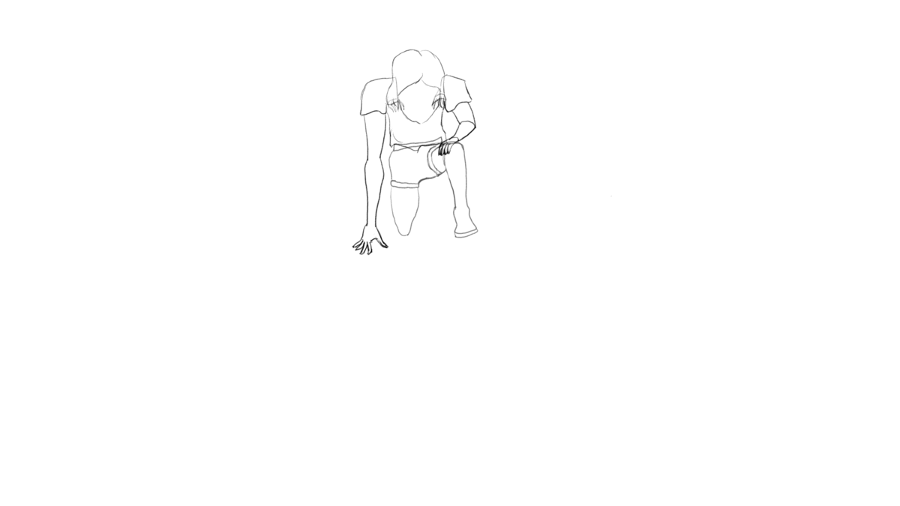

# Project Title

Portfolio Website for my art and animations, (http://nikejohansson.se/elephant)

# Installation

Clone repository.
Open php server in source folder (php -S localhost:8000)

# Code Review

Code review written by [Hampus Selldén](https://github.com/hampussellden).

1. `home.php:6` - We can decrease the amount of require statements we use in the beginning of every file and still change the title using [output buffer](https://www.php.net/manual/en/function.ob-start.php). See [this article](https://stackoverflow.com/questions/13009227/how-to-change-title-of-the-page-after-including-header-php) for an example. Using this we can keep more info in the header.php file and do less in the start of new files.
2. `functions.php:3` - To make best use of declare strict types we should place it on the first line that will be read, meaning before !DOCTYPE in the header file.
3. `functions.php:65` - The function is missing type declarations on the arguments, in this case we want `function isChecked(array $filterOption) : string {`
4. `main.js:5` - Here we can use the .classList.toggle() instead, to save a few lines and make the code easier to read.
5. `funtions.php:5` - This function looks very powerful, but its a lot to read and try to understand. Some comments in the code would help a lot here. I think the array_filter() funtion would be useful here and maybe making the multiple if statements into a switch-statement would make it easier to read

# Testers

Tested by the following people:

1. Johanna
2. Magnus
